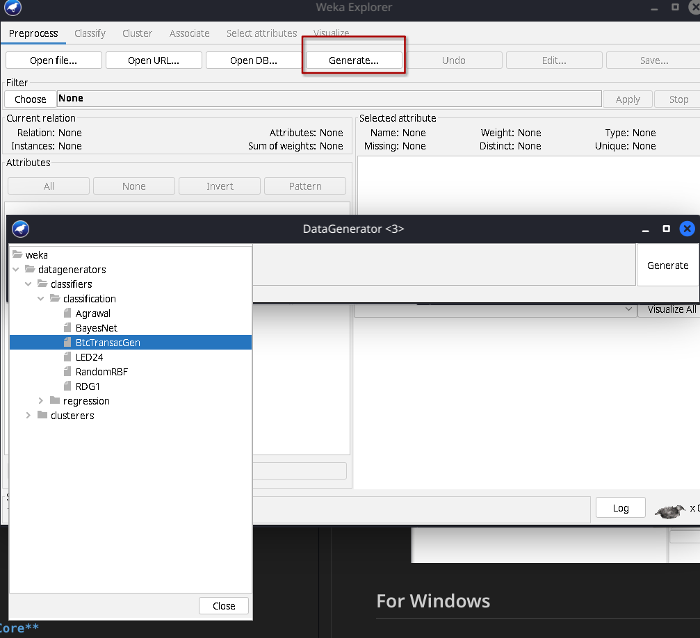

# Application Setup and Execution Guide

This guide provides step-by-step instructions for setting up and running the Application in conjunction with bitcoind in `regtest` mode.
## For Linux 
### Requirements
The BtcTransacGen Weka extension has been tested and is supported on the
following Linux distribution : 
   - Ubuntu 22.04
   - Ubuntu 20.04
   - Kali 2023.3
   - Fedora 39

1. Download and install [**WEKA**](https://waikato.github.io/weka-wiki/downloading_weka/#linux) (3.8.6+) for Linux  
2. Check if **Docker** is already installed 
```shell
docker -v
```
If not, download and install **Docker** 
```shell
sudo apt install docker.io
```
3. Check if **Java JDK 17 or +** is already installed
```shell
java -version
```
If not, download and install [**JDK 17 or +**](https://www.oracle.com/fr/java/technologies/downloads/) for Linux

4. Check if Maven **3.8.6 or +** is already installed
```shell
mvn -v
```
If not [download](https://maven.apache.org/download.cgi) and [install](https://maven.apache.org/install.html) **Maven** for Linux

5. Open a terminal at the root of the project directory and run the setup file
```shell
./setup.sh
```

### Packaging for WEKA
To create a package for integration with WEKA:

1. **Package the Application**
   
   Inside the `btc-transactions-generator/` folder, clean and package the project with Maven:

   ```shell
   mvn clean package
   ```

   This command generates a `.zip` file in the project's `dist` folder.

2. **Import the Package into WEKA**

   - Launch WEKA from the previoulsy installed folder
      ```shell
      ./weka.sh
      ```
   - Navigate to `Tools > Package Manager > Unofficial > File/URL`

      
      
   - Select the `.zip` file created by the previous step, import it, and restart WEKA for the changes to take effect

      

### Running the generator
   1. Lauch WEKA with privileges
   ```shell
   sudo ./weka.sh
   ```
   2. Navigate to `Explorer > Generate > Choose ` and select the `BtcTransacGen` 

      
      
   3. Enter the parameters you want and click on `generate`

      

## For Windows
### Requirements
The BtcTransacGen Weka extension has been tested and is supported on the
following Widonws distribution : 
   - Windows 11
   - Windows 10

1. Download and install [**WEKA**](https://waikato.github.io/weka-wiki/downloading_weka/#windows) (3.8.6+) for Windows  
2. Download and install [**Docker**](https://docs.docker.com/desktop/install/windows-install/) for Windows 
3. Download and install [**JDK 17 or +**](https://www.oracle.com/fr/java/technologies/downloads/#jdk22-windows/) for Windows

4. [Download](https://maven.apache.org/download.cgi) and [install](https://maven.apache.org/install.html) **Maven** for Windows [(see here)](https://maven.apache.org/guides/getting-started/windows-prerequisites.html)


5. Create a directory `.bitcoin\` located in `C:\Users\<user>`
6. Create a `bitcoin.conf` file located in `C:\Users\<user>\.bitcoin\` with the following settings : 
   ```plaintext
   # Maintain full transaction index, used in lookups by the getrawtransaction call
   txindex=1
   listen=1

   # Run bitcoind in regtest mode
   regtest=1

   # Accept command line and JSON-RPC commands
   server=1
   walletbroadcast=1

   # Tells bitcoind that the RPC API settings on the following lines apply to the regtest RPC API
   [regtest]

   # RPC API settings
   rpcconnect=localhost
   rpcport=9997
   rpcuser=user
   rpcpassword=WLMClI3cZ3ghE3diSTK-ENHSenP0bnthnbYmrAg7hcM
   rpcallowip=0.0.0.0/0
   rpcbind=0.0.0.0.
   ```

### Packaging for WEKA
To create a package for integration with WEKA:

1. **Package the Application**
   
   Inside the `btc-transactions-generator\` folder, clean and package the project with Maven:

   ```shell
   mvn clean package
   ```

   This command generates a `.zip` file in the project's `dist` folder.

2. **Import the Package into WEKA**

   - Launch WEKA 
   - Navigate to `Tools > Package Manager > Unofficial > File/URL`

      
      
   - Select the `.zip` file created by the previous step, import it, and restart WEKA for the changes to take effect

      

### Running the generator
   1. Lauch WEKA
   2. Navigate to `Explorer > Generate > Choose ` and select the `BtcTransacGen` 

      
      
   3. Enter the parameters you want and click on `generate`

      

<!---
## DEPRECATED

1. **Download and Install Docker**

   just install docker on your computer.

2. **Create necessary files**
   `/root/.bitcoin/bitcoin.conf` for Unix.
   `C:\Users\<user>\.bitcoin\bitcoin.conf`
3. **Build the package**

Then make the package and import in weka, see section "Packaging for WEKA"
You can then generate.


## Setting Up Bitcoin Core

1. **Download and Install Bitcoin Core**

   Download the `bitcoind` and `bitcoin-cli` executables from the [official Bitcoin Core website](https://bitcoin.org/en/download) suitable for your operating system.

2. **Configure Bitcoin Core**

   Create a `bitcoin.conf` file in a directory `.bitoin/` located in `C:\Users\<user>` or in root for unix systems and populate it with the following settings:

   ```plaintext
   # Maintain a full transaction index, used by the getrawtransaction call
   txindex=1

   # Run bitcoind in regtest mode
   regtest=1

   # Accept command line and JSON-RPC commands
   server=1

   # RPC API settings for regtest mode
   [regtest]
   rpcconnect=localhost
   rpcport=9997
   rpcuser=user
   rpcpassword=WLMClI3cZ3ghE3diSTK-ENHSenP0bnthnbYmrAg7hcM
   # Optional: rpcauth=
   ```

3. **Generate RPC Credentials**
   /!!!DO NOT DO THIS STEP!!!/
   Generate new RPC credentials using the `rpcauth.py` script located in `<unpacked_folder>/share/rpcauth`. Replace `<YOUR_USERNAME>` with your desired username:

   ```shell
   <unpacked_folder>/share/rpcauth/rpcauth.py <YOUR_USERNAME>
   ```

   Note the output and use it to replace the placeholders in `bitcoin.conf` for `rpcuser`, `rpcpassword`, and optionally `rpcauth`.
   /!!!DO NOT DO THIS STEP!!!/

4. **Start Bitcoin Core**

   Start `bitcoind` with the following command, adjusting the `-conf` flag to the path of your `bitcoin.conf` file:

   ```shell
   bitcoind --fallbackfee=0.0002 -conf=<Path/To/bitcoin.conf>
   ```

   To launch second node, create a `data/` directory inside the `.bitoin/` directory. And run:

   ```shell
   bitcoind -port=2223 -rpcport=8333 -datadir=<Path/To/data/> -conf=<Path/To/bitcoin.conf>
   ```

## Running the Application

### Compilation

Ensure Maven is installed on your system. Compile the project from the root directory using Maven:

```shell
mvn compile
```

### Execution

Execute the application with Maven, specifying the main class and the arguments for the output file name and the number of transactions:

```shell
mvn exec:java -Dexec.mainClass="weka.datagenerators.classifiers.classification.BtcTransacGen" -Dexec.args="-n 3"
```

### Packaging for WEKA

To create a package for integration with WEKA:

1. **Package the Application**

   Clean and package the project with Maven:

   ```shell
   mvn clean package
   ```

   This command generates a `.zip` file in the project's `dist` folder.

2. **Import the Package into WEKA**

   - Open WEKA, navigate to `Tools > Package Manager > Unofficial > File/URL`.
   - Select the `.zip` file created by the previous step, import it, and restart WEKA for the changes to take effect.

### Usage in WEKA

- With WEKA opened, navigate to Explorer or Workbench.
- Click on `Generate`.
- Select `BtcTransacGen`, adjust the number of transactions as desired, and click `Generate`.
- **Note**: Make sure the `bitcoind` server is running before attempting to generate transactions.
-->
### Troubleshooting

If you encounter any issues, consider deleting the `regtest` folder within your Bitcoin Core data directory (`AppData/Roaming/Bitcoin` on Windows, or the corresponding directory on Unix systems), then restart the `bitcoind` server and try regenerating the transactions.
